# ViralSnipAI — System Architecture Flowchart

**Source:** Generated 2026-03-18 from live codebase scan
**FigJam:** https://www.figma.com/online-whiteboard/create-diagram/a3241f4a-12f7-421f-954f-2efafb56737a

---

## Feature Inventory

| Feature | Entry Point | DB Tables | External APIs | Inngest Jobs | Status |
|---------|-------------|-----------|---------------|--------------|--------|
| Niche Discovery | `/niche-discovery/page.tsx` | Niche, ContentIdea | None (static data) | None | Built |
| Keywords | `/keywords/page.tsx` | KeywordResearch, SavedKeyword | DataForSEO, YouTube Data API | None | Built |
| Competitors | `/competitors/page.tsx` | Competitor, CompetitorSnapshot, CompetitorVideo | YouTube Data API | competitorsSyncRequested, competitorsSyncStaleCron | Built |
| Content Calendar | `/dashboard/content-calendar/page.tsx` | ContentCalendar, ContentIdea | OpenRouter (OPENROUTER_CONTENT_CALENDAR_MODEL) | None | Built |
| Script Generator | `/dashboard/script-generator/page.tsx` | GeneratedScript, ScriptVersion, ScriptAudio | OpenRouter (OPENROUTER_SCRIPTS_MODEL), ElevenLabs | None | Built |
| Title Generator | `/dashboard/title-generator/page.tsx` | GeneratedTitle | OpenRouter (OPENROUTER_TITLES_MODEL) | None | Built |
| Thumbnail Generator | `/dashboard/thumbnail-generator/page.tsx` | Thumbnail | Google Imagen (gemini-2.5-flash-image) | None | Built |
| RepurposeOS | `/repurpose/page.tsx` | Project, Asset, Clip, Export | FFmpeg, S3/Supabase Storage, OpenRouter | None | Built |
| Hooksmith | `/hooksmith/page.tsx` | None (uses Project) | OpenRouter (OPENROUTER_HOOKS_MODEL) | None | Built |
| Brand Kit | `/brand-kit/page.tsx` | BrandKit | S3/Supabase Storage | None | Built |
| Projects | `/projects/page.tsx` | Project, Asset, Clip | None | None | Built |
| Transcribe | `/transcribe/page.tsx` | TranscriptJob | OpenAI Whisper | None | Flag-gated (TRANSCRIBE_UI_ENABLED=false) |
| Voicer | `/voicer/page.tsx` | VoiceProfile, VoiceRender | ElevenLabs | None | Built |
| Imagen | `/imagen/page.tsx` | None | Google Imagen | None | Flag-gated (IMAGEN_ENABLED) |
| Veo | `/veo/page.tsx` | None | Google Veo | None | Flag-gated (VEO_ENABLED + FORCE_VEO_ENABLED) |
| SnipRadar Overview | `/snipradar/overview/page.tsx` | XAccount, TweetDraft, ViralTweet | X API v2 | None | Built |
| SnipRadar Discover | `/snipradar/discover/page.tsx` | ViralTweet, XTrackedAccount | None (reads DB) | snipRadarFetchViral, snipRadarAnalyze | Built |
| SnipRadar Inbox | `/snipradar/inbox/page.tsx` | XResearchInboxItem | None | None | Built |
| SnipRadar Relationships | `/snipradar/relationships/page.tsx` | XRelationshipLead, XRelationshipInteraction | None | None | Built |
| SnipRadar Create | `/snipradar/create/page.tsx` | TweetDraft, XStyleProfile, ViralTemplate | OpenRouter (multiple models), X API v2 | snipRadarDailyDrafts | Built |
| SnipRadar Publish | `/snipradar/publish/page.tsx` | TweetDraft, XSchedulerRun, XAutoDmAutomation | X API v2 | snipRadarPostScheduled, snipRadarPostScheduledPerUser | Built |
| SnipRadar Analytics | `/snipradar/analytics/page.tsx` | TweetDraft (actual metrics) | None | snipRadarPostMetrics | Built |
| SnipRadar Growth Planner | `/snipradar/growth-planner/page.tsx` | SnipRadarChatSession | OpenRouter (OPENROUTER_SNIPRADAR_ASSISTANT_MODEL) | None | Built |
| SnipRadar Assistant | `/snipradar/assistant/page.tsx` | SnipRadarChatSession, SnipRadarChatMessage, XResearchDocument | OpenRouter (OPENROUTER_SNIPRADAR_ASSISTANT_MODEL) | None | Built |
| Activity Center | `/activity/page.tsx` | None confirmed | None | None | UI stub — no API route found |
| Billing | `/billing/page.tsx` | Subscription, RazorpayWebhookEvent, UsageTracking | Razorpay | None | Built |

### Flagged Items
- **UI Stub Only:** `/activity/page.tsx` — page exists, no dedicated API route or DB table wired
- **Flag-Gated (disabled by default):** Transcribe UI, Veo, VEO requires FORCE_VEO_ENABLED=true extra guard
- **YouTube ecosystem:** Gated behind `NEXT_PUBLIC_YOUTUBE_ECOSYSTEM_ENABLED=false` for X-first launch
- **WaitlistLead model:** DB table exists but no active UI feature reads/writes it in workspace routes

---

## Mermaid Source

```mermaid
flowchart LR
  subgraph CLIENT["Client Layer"]
    Browser["Next.js 14 App\nApp Router"]
    Ext["Chrome Extension\nManifest V3"]
  end

  subgraph AUTH["Auth Layer"]
    MW["NextAuth Middleware\nJWT Strategy 30d"]
    Google["Google OAuth\nPKCE + offline_access"]
    Email["Email + bcrypt\nCredentials Provider"]
    Demo["Demo Login\n/signin?dev-bypass=true"]
    MW --> Google & Email & Demo
  end

  subgraph GATE["Ecosystem Gate"]
    Cookie["Cookie: clippers_ecosystem\nyoutube or x"]
    RouteGate["EcosystemRouteGate\ncomponent"]
    SelectScreen["/ecosystem/select"]
    SelectScreen --> Cookie
    Cookie --> RouteGate
  end

  subgraph YOUTUBE["YouTube Ecosystem — /dashboard"]
    YP1["/niche-discovery\nNiche research"]
    YP2["/keywords\nDataForSEO + YouTube API"]
    YP3["/competitors\nYouTube channel tracking"]
    YP4["/dashboard/content-calendar\nAI calendar generation"]
    YP5["/dashboard/script-generator\nScript + TTS + Versions"]
    YP6["/dashboard/title-generator\nCTR-scored titles"]
    YP7["/dashboard/thumbnail-generator\nImagen thumbnails"]
    YP8["/repurpose\nVideo clip extraction"]
    YP9["/hooksmith\nHook templates"]
    YP10["/brand-kit\nColors + watermark"]
    YP11["/projects\nVideo workspaces"]
  end

  subgraph SNIP["X Ecosystem — /snipradar"]
    SP1["Overview\nStats + activation"]
    SP2["Discover\nViral tweet feed"]
    SP3["Inbox\nResearch items"]
    SP4["Relationships\nCRM leads"]
    SP5["Create\n7 tabs: Composer/Thread/Hook/Templates/Research/Predictor/Batch"]
    SP6["Publish\n5 tabs: Calendar/Scheduler/BestTimes/Automations/API"]
    SP7["Analytics\nPost performance"]
    SP8["Growth Planner\nAI strategy"]
    SP9["Assistant\nRAG chatbot"]
  end

  subgraph AI["AI Layer — OpenRouter Gateway"]
    OR["OpenRouter Client\nPrimary router"]
    OAI["OpenAI Fallback\ngpt-5-mini default"]
    M1["Hooks: OPENROUTER_SNIPRADAR_HOOKS_MODEL"]
    M2["Scripts: OPENROUTER_SCRIPTS_MODEL"]
    M3["Viral analysis: OPENROUTER_SNIPRADAR_VIRAL_ANALYSIS_MODEL"]
    M4["Draft gen: OPENROUTER_SNIPRADAR_DRAFT_GENERATION_MODEL"]
    M5["Extension reply: OPENROUTER_SNIPRADAR_EXTENSION_REPLY_MODEL"]
    M6["Research: OPENROUTER_SNIPRADAR_RESEARCH_BRIEF_MODEL"]
    M7["Style: OPENROUTER_SNIPRADAR_STYLE_ANALYSIS_MODEL"]
    M8["Thumbnails: Google Imagen gemini-2.5-flash-image"]
    M9["Assistant: OPENROUTER_SNIPRADAR_ASSISTANT_MODEL"]
    OR --> M1 & M2 & M3 & M4 & M5 & M6 & M7 & M9
    OR --> OAI
  end

  subgraph JOBS["Background Jobs — Inngest"]
    J1["snipRadarFetchViral — Cron every 6h"]
    J2["snipRadarAnalyze — Event: tweets.fetched"]
    J3["snipRadarDailyDrafts — Cron 7am UTC"]
    J4["snipRadarGrowthSnapshot — Cron midnight UTC"]
    J5["snipRadarPostScheduled — Cron every 1min"]
    J6["snipRadarPostScheduledPerUser — Event fan-out"]
    J7["snipRadarPostMetrics — Event tweet.posted 24h delay"]
    J8["snipRadarMaintenanceCron — Cron every 2h at :15"]
    J9["competitorsSyncStaleCron — Cron every 6h"]
    J10["competitorsSyncRequested — Event sync.requested"]
  end

  subgraph EXT_SVC["External Services"]
    XAPI["X Twitter API v2 — OAuth 2.0 PKCE"]
    YTAPI["YouTube Data API v3"]
    DFIO["DataForSEO — Keywords"]
    ELABS["ElevenLabs — TTS"]
    RPY["Razorpay — INR + USD billing"]
    S3["AWS S3 / Supabase Storage"]
    FFMPEG["FFmpeg — Video render"]
    INNGEST["Inngest Platform"]
  end

  Browser --> AUTH
  AUTH --> GATE
  GATE -->|"youtube"| YOUTUBE
  GATE -->|"x"| SNIP
  YOUTUBE & SNIP --> AI
  YOUTUBE & SNIP & JOBS --> DB
  AI & JOBS & YOUTUBE & SNIP --> EXT_SVC
```

