# ViralSnipAI — Data Model Relationships (ER)

**Source:** Generated 2026-03-18 from prisma/schema.prisma (1580 lines, 35+ models)
**FigJam:** https://www.figma.com/online-whiteboard/create-diagram/81a30347-e16f-449d-9b56-f945928d665a

---

## Table Inventory

| Model | Rows Written By | Orphan / Stub Flag |
|-------|-----------------|-------------------|
| User | Auth (Google OAuth, Email, Demo) | — |
| Account | NextAuth Google OAuth signIn callback | — |
| Session | NextAuth | — |
| VerificationToken | NextAuth email verification | — |
| Subscription | Razorpay webhook handler | — |
| RazorpayWebhookEvent | /api/billing/webhook/razorpay | — |
| UsageTracking | Billing service on feature use | — |
| ActivationCheckpoint | lib/analytics/activation.ts | — |
| Project | /api/projects | — |
| Asset | /api/repurpose/ingest | — |
| Clip | /api/repurpose/auto-highlights | — |
| Export | /api/exports | — |
| YouTubeIngestJob | /api/repurpose/ingest | — |
| Script | /api/projects/[id]/script | — |
| BrandKit | /api/brand-kit | — |
| TranscriptJob | /api/transcribe/jobs | — |
| VoiceProfile | /api/voicer/voices | — |
| VoiceRender | /api/voicer/speak | — |
| TranscriptTranslation | /api/assets/[assetId]/translations | — |
| CaptionTranslation | /api/clips/[id]/route | — |
| VoiceTranslation | /api/assets/[assetId]/voice-translations | — |
| GeneratedScript | /api/scripts | — |
| ScriptVersion | /api/scripts/[scriptId]/versions | — |
| ScriptShare | /api/scripts/[scriptId]/share | — |
| ScriptComment | /api/scripts/[scriptId]/comments | — |
| ScriptAudio | /api/scripts/[scriptId]/synthesize | — |
| GeneratedTitle | /api/titles | — |
| Thumbnail | /api/thumbnails | — |
| ContentCalendar | /api/content-calendar | — |
| ContentIdea | /api/content-calendar/ideas | — |
| KeywordResearch | /api/keywords/search | — |
| SavedKeyword | /api/keywords/saved | — |
| Competitor | /api/competitors | — |
| CompetitorSnapshot | competitorsSyncRequested Inngest job | — |
| CompetitorVideo | competitorsSyncRequested Inngest job | — |
| CompetitorAlert | competitorsSyncRequested Inngest job | — |
| UsageLog | Billing service | — |
| Niche | Seed data / static | Orphan candidate — no active write route found |
| WaitlistLead | No active route found | **Orphaned table** — DB model exists, no workspace feature reads/writes it |
| XAccount | /api/snipradar/accounts | — |
| XAccountSnapshot | snipRadarGrowthSnapshot Inngest cron | — |
| XTrackedAccount | /api/snipradar/accounts (add tracked) | — |
| XProfileAuditSnapshot | /api/snipradar/profile-audit | — |
| ViralTweet | snipRadarFetchViral Inngest cron | — |
| TweetDraft | /api/snipradar/drafts | — |
| XStyleProfile | /api/snipradar/style | — |
| XSchedulerRun | snipRadarPostScheduledPerUser | — |
| XEngagementOpportunity | /api/snipradar/engagement | — |
| XAutoDmAutomation | /api/snipradar/automations/dm | — |
| XAutoDmDelivery | snipRadarPostScheduledPerUser | — |
| XResearchInboxItem | /api/snipradar/inbox, /api/snipradar/extension/draft | — |
| XRelationshipLead | /api/snipradar/relationships | — |
| XRelationshipInteraction | /api/snipradar/relationships/[id] | — |
| XResearchDocument | /api/snipradar/research/index | — |
| XResearchIndexRun | /api/snipradar/research/index | — |
| ViralTemplate | /api/snipradar/templates | — |
| SnipRadarApiKey | /api/snipradar/developer/keys | — |
| SnipRadarWebhookSubscription | /api/snipradar/developer/webhooks | — |
| SnipRadarWebhookEvent | Webhook dispatch service | — |
| SnipRadarWebhookDelivery | Webhook dispatch service | — |
| SnipRadarKbChunk | /api/snipradar/assistant/ingest | — |
| SnipRadarChatSession | /api/snipradar/assistant/sessions | — |
| SnipRadarChatMessage | /api/snipradar/assistant/chat | — |

### Flagged Items
- **Orphaned Table:** `WaitlistLead` — exists in schema, no active UI or API route writes to it in the workspace
- **Orphan Candidate:** `Niche` — populated via seed data, no active user-facing write endpoint found
- **Dead Route:** `/api/snipradar/winners` — route exists, no UI component found calling it directly

---

## Mermaid Source (flowchart ER representation)

```mermaid
flowchart TB
  subgraph CORE["Core — User owns everything"]
    USER[["User\nid email plan subscriptionTier\nrazorpayCustomerId onboardingCompleted"]]
  end

  subgraph AUTH_M["Auth Models"]
    ACCT[["Account\nprovider providerAccountId access_token"]]
    SESS[["Session\nsessionToken expires"]]
  end

  subgraph BILLING_M["Billing Models"]
    SUBS[["Subscription\nplanId status razorpaySubscriptionId\ncurrentPeriodStart currentPeriodEnd"]]
    RPWH[["RazorpayWebhookEvent\nproviderEventId eventType payload"]]
    UTRK[["UsageTracking\nmonth viralFetches scheduledPosts"]]
    ACTV[["ActivationCheckpoint"]]
  end

  subgraph YT_CORE["YouTube — Project Pipeline"]
    PROJ[["Project\ntitle topic sourceUrl"]]
    ASSET[["Asset\ntype durationSec transcript"]]
    CLIP[["Clip\nstartMs endMs viralityScore captionSrt"]]
    EXPO[["Export\npreset status outputPath"]]
    PROJ --> ASSET --> CLIP --> EXPO
  end

  subgraph YT_AI["YouTube — AI Content"]
    SCRIPT[["GeneratedScript\nhook intro mainContent conclusion"]]
    TITLE[["GeneratedTitle\nctrScore keywordOptimizationScore"]]
    THUMB[["Thumbnail\nthumbnailStyle imageUrl ctrScore"]]
    CCAL[["ContentCalendar"]]
    CIDEA[["ContentIdea\nviralityScore scheduledDate status"]]
    CCAL --> CIDEA
  end

  subgraph YT_TOOLS["YouTube — Research"]
    BRAND[["BrandKit\nprimaryHex fontFamily watermark"]]
    COMP[["Competitor\nchannelId subscriberCount syncStatus"]]
    CSNAP[["CompetitorSnapshot"]]
    KRES[["KeywordResearch\nsearchVolume competition difficulty"]]
    COMP --> CSNAP
  end

  subgraph SR_CORE["SnipRadar — X Accounts"]
    XACCT[["XAccount\nxUserId accessToken followerCount"]]
    XTRK[["XTrackedAccount\ntrackedXUserId niche isActive"]]
    VTWT[["ViralTweet\nviralScore hookType format"]]
    TDFT[["TweetDraft\nstatus threadGroupId scheduledFor"]]
    XTRK --> VTWT
    VTWT -.->|"inspires"| TDFT
  end

  subgraph SR_INBOX["SnipRadar — Research"]
    INBOX[["XResearchInboxItem\nsource status labels generatedReply"]]
    XDOC[["XResearchDocument\nbody embedding embeddedAt"]]
  end

  subgraph SR_CRM["SnipRadar — CRM"]
    XLEAD[["XRelationshipLead\nstage source priorityScore"]]
    XINT[["XRelationshipInteraction\ntype channel summary"]]
    XLEAD --> XINT
  end

  subgraph SR_AUTO["SnipRadar — Automations"]
    AUTODM[["XAutoDmAutomation\ntriggerTweetId dailyCap isActive"]]
    XENG[["XEngagementOpportunity\nscore status niche"]]
  end

  USER --> ACCT & SESS
  USER --> SUBS & RPWH & UTRK & ACTV
  USER --> PROJ & BRAND & KRES & COMP & SCRIPT & TITLE & THUMB & CCAL
  USER --> XACCT & XTRK & TDFT & INBOX & XLEAD & XDOC & AUTODM & XENG
```

